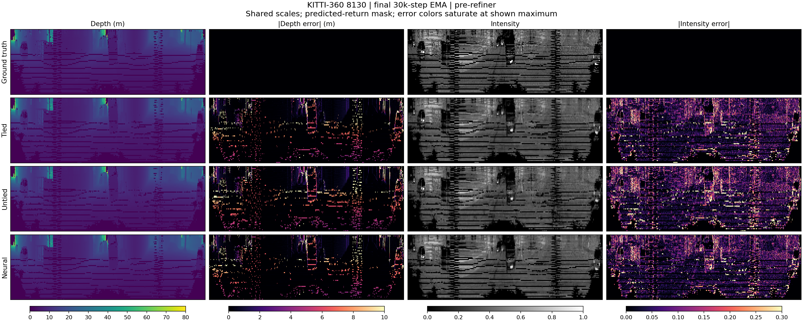

# Modi01：8120 最终 checkpoint 联合评估

三个方法均完成 30,000 步；以下为最终 epoch 639 checkpoint 的新评估，不是训练中 epoch 600 的旧指标。

本轮优先保留 neural 作为后续候选：五类核心指标的 EMA 开发集均值均最好。

补充：[与标准 STGC 的历史结果比较](STANDARD_STGC_COMPARISON.md)。标准历史结果经过 refinement，本次候选尚未训练 refiner；neural 的数值仍未超过该标准结果，不能把候选内部排名当作超过标准 STGC 的证据。

## 结论依据

- Hybrid 4/4（untied） 相对 tied：CD +2.60%，深度 RMSE +2.31%，强度 RMSE +3.24%，点云 F-score -1.490 个百分点，回波 F1 -0.190 个百分点。
- Hybrid 4/4（neural） 相对 tied：CD -13.09%，深度 RMSE -3.53%，强度 RMSE -2.19%，点云 F-score +1.443 个百分点，回波 F1 +0.292 个百分点。

neural 对 tied 的逐帧胜出数（共 4 帧）：cd_m2=3/4；point_fscore=4/4；depth_rmse_m=4/4；intensity_rmse=4/4；return_f1=4/4。

untied 的训练集 CD、强度 RMSE 与回波 F1 优于 tied，但开发集这三项均较差；当前预算下没有可见的开发集收益。该现象符合拟合与泛化差距增大的表现，尚不能据此确定原因。

各指标最优：cd_m2=hybrid44_neural；point_fscore=hybrid44_neural；depth_rmse_m=hybrid44_neural；intensity_rmse=hybrid44_neural；return_rmse=hybrid44_neural；return_accuracy=hybrid44_neural；return_f1=hybrid44_neural。

这是单场景、单 seed、三个候选之间的开发集比较。尚未训练同配置 all-modal 对照，不能据此声称超过原始 STGC 或证明混合表示本身有效；没有自动选为 Best/lastBest。

## 最终 EMA / pre-refiner：开发集主表

| 方法 | CD ↓ (m²) | 点云 F-score ↑ | 深度 RMSE ↓ (m) | 强度 RMSE ↓ | 回波 RMSE ↓ | 回波 Acc ↑ | 回波 F1 ↑ |
|---|---:|---:|---:|---:|---:|---:|---:|
| Hybrid 4/4（tied） | 0.078059 | 0.931892 | 3.187038 | 0.118873 | 0.316032 | 0.893160 | 0.925379 |
| Hybrid 4/4（untied） | 0.080091 | 0.916996 | 3.260658 | 0.122729 | 0.318633 | 0.890192 | 0.923476 |
| Hybrid 4/4（neural） | 0.067839 | 0.946321 | 3.074670 | 0.116271 | 0.313493 | 0.897459 | 0.928295 |

## 最终 raw / pre-refiner：开发集对照

| 方法 | CD ↓ (m²) | 点云 F-score ↑ | 深度 RMSE ↓ (m) | 强度 RMSE ↓ | 回波 RMSE ↓ | 回波 Acc ↑ | 回波 F1 ↑ |
|---|---:|---:|---:|---:|---:|---:|---:|
| Hybrid 4/4（tied） | 0.079805 | 0.931883 | 3.185819 | 0.119485 | 0.315752 | 0.892321 | 0.924735 |
| Hybrid 4/4（untied） | 0.085432 | 0.917010 | 3.260097 | 0.122680 | 0.317706 | 0.891067 | 0.924288 |
| Hybrid 4/4（neural） | 0.067108 | 0.945753 | 3.075540 | 0.116851 | 0.313436 | 0.897084 | 0.928134 |

## 最终 EMA / pre-refiner：47 帧训练集

| 方法 | CD ↓ (m²) | 点云 F-score ↑ | 深度 RMSE ↓ (m) | 强度 RMSE ↓ | 回波 RMSE ↓ | 回波 Acc ↑ | 回波 F1 ↑ |
|---|---:|---:|---:|---:|---:|---:|---:|
| Hybrid 4/4（tied） | 0.050433 | 0.970751 | 2.335591 | 0.088455 | 0.279685 | 0.943894 | 0.959015 |
| Hybrid 4/4（untied） | 0.049870 | 0.973121 | 2.344204 | 0.086444 | 0.276726 | 0.947174 | 0.961394 |
| Hybrid 4/4（neural） | 0.053050 | 0.969646 | 2.414548 | 0.089346 | 0.279889 | 0.943442 | 0.958694 |

下表是不同帧集合指标均值之差，仅用于拟合差距诊断，不是泛化误差界或显著性结论。

| 方法 | CD 开发−训练 (m²) | 深度 RMSE 开发−训练 (m) | 强度 RMSE 开发−训练 |
|---|---:|---:|---:|
| hybrid44 | 0.027626 | 0.851447 | 0.030419 |
| hybrid44_untied | 0.030221 | 0.916454 | 0.036285 |
| hybrid44_neural | 0.014789 | 0.660123 | 0.026926 |

下一项有信息价值的对照是相同 8120、seed 0、30k 预算的 all-modal，用来判断 4/4 混合相对原表示的收益。本次仅评估已完成的三个候选，没有启动该训练。

## 距离与深度边缘诊断

下表使用 EMA 开发集，按像素合并平方误差后开根号；不同于主表的逐帧 RMSE 均值。深度/强度均使用预测回波硬掩码，漏回波按零预测计入误差。距离由有效 GT 深度定义。边缘定义为相邻有效 GT 深度差 >1 m 的两侧像素（水平环绕、垂直不环绕）；这是几何诊断，不是语义边缘标签。

| 区域 | 像素数 | 方法 | 深度 RMSE (m) | 强度 RMSE | GT 回波召回 |
|---|---:|---|---:|---:|---:|
| gt_return | 194165 | hybrid44 | 2.520022 | 0.114748 | 0.944660 |
| gt_return | 194165 | hybrid44_untied | 2.565191 | 0.118946 | 0.943507 |
| gt_return | 194165 | hybrid44_neural | 2.409795 | 0.112702 | 0.947030 |
| depth_edge | 21787 | hybrid44 | 5.301751 | 0.129693 | 0.974021 |
| depth_edge | 21787 | hybrid44_untied | 5.449140 | 0.134689 | 0.967136 |
| depth_edge | 21787 | hybrid44_neural | 5.030741 | 0.129166 | 0.972736 |
| non_edge_gt_return | 172378 | hybrid44 | 1.897496 | 0.112718 | 0.940950 |
| non_edge_gt_return | 172378 | hybrid44_untied | 1.912836 | 0.116806 | 0.940520 |
| non_edge_gt_return | 172378 | hybrid44_neural | 1.828205 | 0.110447 | 0.943781 |
| range_0_10m | 134921 | hybrid44 | 1.756164 | 0.117008 | 0.927039 |
| range_0_10m | 134921 | hybrid44_untied | 1.791076 | 0.121512 | 0.923859 |
| range_0_10m | 134921 | hybrid44_neural | 1.679699 | 0.115438 | 0.929040 |
| range_10_30m | 54806 | hybrid44 | 2.231765 | 0.109438 | 0.985494 |
| range_10_30m | 54806 | hybrid44_untied | 2.129806 | 0.113006 | 0.989217 |
| range_10_30m | 54806 | hybrid44_neural | 2.008854 | 0.106270 | 0.988943 |
| range_30_50m | 3362 | hybrid44 | 6.828352 | 0.107367 | 0.991374 |
| range_30_50m | 3362 | hybrid44_untied | 7.057637 | 0.108690 | 0.991969 |
| range_30_50m | 3362 | hybrid44_neural | 6.832922 | 0.103947 | 0.990779 |
| range_50_80m | 1076 | hybrid44 | 18.969778 | 0.115016 | 0.928439 |
| range_50_80m | 1076 | hybrid44_untied | 19.961835 | 0.119420 | 0.927509 |
| range_50_80m | 1076 | hybrid44_neural | 18.511928 | 0.110068 | 0.931227 |
| range_80_infm | 0 | hybrid44 | N/A | N/A | N/A |
| range_80_infm | 0 | hybrid44_untied | N/A | N/A | N/A |
| range_80_infm | 0 | hybrid44_neural | N/A | N/A | N/A |

所有像素的合并回波统计：

| 方法 | Precision | Recall | F1 | TP | FP | FN | TN |
|---|---:|---:|---:|---:|---:|---:|---:|
| hybrid44 | 0.909249 | 0.944660 | 0.926616 | 183420 | 18307 | 10745 | 59448 |
| hybrid44_untied | 0.906525 | 0.943507 | 0.924646 | 183196 | 18890 | 10969 | 58865 |
| hybrid44_neural | 0.912655 | 0.947030 | 0.929525 | 183880 | 17598 | 10285 | 60157 |

## 四帧一致性

| EMA 帧 | 方法 | CD (m²) | 深度 RMSE (m) | 强度 RMSE | 回波 F1 |
|---:|---|---:|---:|---:|---:|
| 8130 | hybrid44 | 0.079199 | 3.153311 | 0.094778 | 0.966882 |
| 8130 | hybrid44_untied | 0.081242 | 3.332776 | 0.105602 | 0.958278 |
| 8130 | hybrid44_neural | 0.069823 | 3.025699 | 0.090917 | 0.969503 |
| 8140 | hybrid44 | 0.060337 | 2.646249 | 0.092829 | 0.969186 |
| 8140 | hybrid44_untied | 0.057394 | 2.810601 | 0.094730 | 0.967925 |
| 8140 | hybrid44_neural | 0.053505 | 2.569506 | 0.091217 | 0.969853 |
| 8150 | hybrid44 | 0.109315 | 3.850979 | 0.147875 | 0.879115 |
| 8150 | hybrid44_untied | 0.117219 | 3.964496 | 0.152676 | 0.874789 |
| 8150 | hybrid44_neural | 0.080592 | 3.628704 | 0.144028 | 0.884608 |
| 8160 | hybrid44 | 0.063384 | 3.097612 | 0.140013 | 0.886332 |
| 8160 | hybrid44_untied | 0.064509 | 2.934760 | 0.137907 | 0.892910 |
| 8160 | hybrid44_neural | 0.067436 | 3.074772 | 0.138922 | 0.889217 |

## 预算与可比性

| 方法 | 参数总数 | 训练时长 | 最终步数 | EMA 更新次数 |
|---|---:|---:|---:|---:|
| hybrid44 | 53,202,903 | 3h 53m | 30000 | 639 |
| hybrid44_untied | 53,202,903 | 3h 55m | 30000 | 639 |
| hybrid44_neural | 53,138,395 | 4h 10m | 30000 | 639 |

- neural 比 tied/untied 少 64,508 个参数（总模型约 0.121%；按场景场统计约 0.138%）。未建立完全等容量的 neural 对照，不能仅凭结果作严格的表示机制归因。
- neural 训练总耗时比 tied 增加 7.39%，包括相同周期的开发评估开销；这不是纯 kernel 性能测量。
- 非路径训练选项一致，seed=0、同一预算与数据协议。通过直接读取内容比较 63 个原始 Python 源文件和三个 Modi01 快照，未发现差异；未计算任何文件摘要。
- KITTI-360 8120–8170，共 51 个时刻；train 为排除 8130/8140/8150/8160 后的 47 帧，val/test 共用这 4 帧。时间为 (frame_id−8120)/50。
- 直接调用归档 Trainer.eval_step 与四类指标；AMP、预加载 GT 精度、每条射线 768 采样、4096 射线渲染分块、无 perturb、回波阈值 >0.5 与训练时周期评估一致。主表每帧独立计算后等权平均；额外完整指标在 summary.csv。
- CD 是双向最近邻平方距离均值之和，单位 m²；点云 F-score 使用平方距离阈值 0.05 m²，即半径约 0.2236 m。深度截断至 80 m；强度范围 [0,1]。
- EMA 每个 epoch 更新一次，最终 639 次；raw 与 EMA 分别严格载入。无优化器、无训练或 refiner 更新。每组结束直接比较参数值，确认未变化；checkpoint 大小及修改时间未变化。
- refiner 未训练，因此本次只有 pre-refiner；post-refiner 未评估。没有可靠 moving/static 标签，未报告该分层。原始权重只评估开发集；训练集使用与主比较一致的 EMA。
- 只有 4 个彼此相关的开发帧，未作统计显著性或跨场景泛化结论。

## 预测可视化与文件

预先固定展示首个开发帧 8130；各方法采用共同色标。完整 4 帧的 EMA/raw 浮点预测保存在本机各方法 predictions/ 目录，未上传到 Git。

- summary.csv / summary.json：汇总及协议；per_frame.csv：全部 165 次帧评估。
- 每个方法 results.json：完整主指标、分层与源码路径；evaluate.log：执行日志。
- evaluate_source.py：本次评估入口副本；comparability.json：配置与源代码比较结果。

执行方式：在仓库激活环境后，使用 `python Modi01/evaluate.py --output Modi01/evaluations/<新目录>`，完成后运行 `python Modi01/summarize_evaluation.py <评估目录>`。
