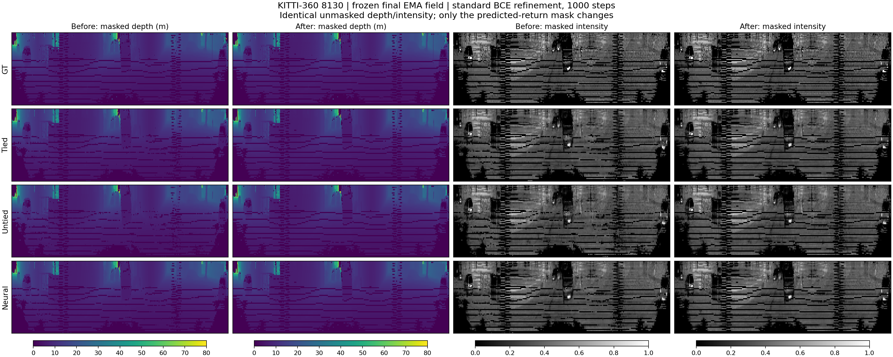

# Modi01：标准 BCE refinement 与最终比较

三个 8120 / seed 0 候选均从各自 30,000 步最终 EMA 主干出发，完成 1,000 步标准 STGC ray-drop refinement。只更新 U-Net，主干及原始 checkpoint 未变化。

本次 refinement 后的候选最优指标：cd_m2=hybrid44_neural；point_fscore=hybrid44_neural；depth_rmse_m=hybrid44_neural；intensity_rmse=hybrid44_neural；return_f1=hybrid44_neural。

neural 相对标准历史结果：CD -1.53%，深度 RMSE +5.01%，强度 RMSE +2.79%，点云 F-score -0.519 个百分点。应联合判断这些指标，不能仅依据 CD 宣称整体优于标准 STGC。

## Refinement 后：4 帧开发集与标准历史结果

| 方法 | CD ↓ (m²) | 点云 F-score ↑ | 深度 RMSE ↓ (m) | 强度 RMSE ↓ | 回波 RMSE ↓ | 回波 Acc ↑ | 回波 F1 ↑ |
|---|---:|---:|---:|---:|---:|---:|---:|
| 标准 STGC（历史，refinement 后） | 0.067389 | 0.953466 | 2.328985 | 0.090163 | 未记录 | 未记录 | 未记录 |
| hybrid44 | 0.077433 | 0.934147 | 2.532998 | 0.095220 | 0.178864 | 0.954711 | 0.967787 |
| hybrid44_untied | 0.082208 | 0.918040 | 2.670145 | 0.099792 | 0.185913 | 0.952012 | 0.965876 |
| hybrid44_neural | 0.066361 | 0.948279 | 2.445591 | 0.092675 | 0.172241 | 0.958311 | 0.970315 |

以上候选使用 EMA 主干 + 最终 U-Net；U-Net 自身未做 EMA。标准行来自历史汇总，未在本次重新运行。

相对标准历史结果的数值差（误差项负值更好，F-score 正值更好）：

| 方法 | CD 相对变化 | 深度 RMSE 相对变化 | 强度 RMSE 相对变化 | 点云 F-score 差（百分点） |
|---|---:|---:|---:|---:|
| hybrid44 | +14.90% | +8.76% | +5.61% | -1.932 |
| hybrid44_untied | +21.99% | +14.65% | +10.68% | -3.543 |
| hybrid44_neural | -1.53% | +5.01% | +2.79% | -0.519 |

## Refinement 前后

| 方法 | CD ↓ (m²) | 点云 F-score ↑ | 深度 RMSE ↓ (m) | 强度 RMSE ↓ | 回波 RMSE ↓ | 回波 Acc ↑ | 回波 F1 ↑ |
|---|---:|---:|---:|---:|---:|---:|---:|
| hybrid44 / 前 | 0.078059 | 0.931892 | 3.187038 | 0.118873 | 0.316032 | 0.893160 | 0.925379 |
| hybrid44 / 后 | 0.077433 | 0.934147 | 2.532998 | 0.095220 | 0.178864 | 0.954711 | 0.967787 |
| hybrid44_untied / 前 | 0.080091 | 0.916996 | 3.260658 | 0.122729 | 0.318633 | 0.890192 | 0.923476 |
| hybrid44_untied / 后 | 0.082208 | 0.918040 | 2.670145 | 0.099792 | 0.185913 | 0.952012 | 0.965876 |
| hybrid44_neural / 前 | 0.067839 | 0.946321 | 3.074670 | 0.116271 | 0.313493 | 0.897459 | 0.928295 |
| hybrid44_neural / 后 | 0.066361 | 0.948279 | 2.445591 | 0.092675 | 0.172241 | 0.958311 | 0.970315 |

未加回波掩码的深度与强度逐元素保持不变，改善来自训练后的回波预测及其掩码；refinement 没有修改深度或强度网络。

## Refinement 后：47 帧训练集

| 方法 | CD ↓ (m²) | 点云 F-score ↑ | 深度 RMSE ↓ (m) | 强度 RMSE ↓ | 回波 RMSE ↓ | 回波 Acc ↑ | 回波 F1 ↑ |
|---|---:|---:|---:|---:|---:|---:|---:|
| hybrid44 | 0.049231 | 0.972179 | 1.652664 | 0.065690 | 0.087506 | 0.989882 | 0.992643 |
| hybrid44_untied | 0.047852 | 0.974454 | 1.648431 | 0.065147 | 0.086995 | 0.990014 | 0.992735 |
| hybrid44_neural | 0.051497 | 0.970956 | 1.721579 | 0.066643 | 0.087630 | 0.989860 | 0.992622 |

## Refinement 后：距离与边缘

开发集按像素合并误差；距离采用有效 GT 深度。边缘为相邻有效 GT 深度差 >1 m 的两侧像素，水平环绕、垂直不环绕。该表不与主表的逐帧 RMSE 平均混为一谈。

| 区域 | 像素数 | 方法 | 深度 RMSE (m) | 强度 RMSE | GT 回波召回 |
|---|---:|---|---:|---:|---:|
| gt_return | 194165 | hybrid44 | 2.177862 | 0.105131 | 0.970185 |
| gt_return | 194165 | hybrid44_untied | 2.286039 | 0.110545 | 0.967682 |
| gt_return | 194165 | hybrid44_neural | 2.067532 | 0.102947 | 0.972019 |
| depth_edge | 21787 | hybrid44 | 4.906042 | 0.129720 | 0.972598 |
| depth_edge | 21787 | hybrid44_untied | 5.149958 | 0.135106 | 0.968926 |
| depth_edge | 21787 | hybrid44_neural | 4.657306 | 0.128735 | 0.971910 |
| non_edge_gt_return | 172378 | hybrid44 | 1.516718 | 0.101601 | 0.969880 |
| non_edge_gt_return | 172378 | hybrid44_untied | 1.591961 | 0.107040 | 0.967525 |
| non_edge_gt_return | 172378 | hybrid44_neural | 1.439962 | 0.099211 | 0.972032 |
| range_0_10m | 134921 | hybrid44 | 1.330350 | 0.103808 | 0.961681 |
| range_0_10m | 134921 | hybrid44_untied | 1.409215 | 0.109737 | 0.957716 |
| range_0_10m | 134921 | hybrid44_neural | 1.228787 | 0.101851 | 0.963601 |
| range_10_30m | 54806 | hybrid44 | 2.059861 | 0.107975 | 0.990293 |
| range_10_30m | 54806 | hybrid44_untied | 2.076331 | 0.112433 | 0.991351 |
| range_10_30m | 54806 | hybrid44_neural | 1.899497 | 0.105384 | 0.991990 |
| range_30_50m | 3362 | hybrid44 | 6.929999 | 0.107686 | 0.990482 |
| range_30_50m | 3362 | hybrid44_untied | 7.347821 | 0.109341 | 0.988697 |
| range_30_50m | 3362 | hybrid44_neural | 6.846861 | 0.104283 | 0.990779 |
| range_50_80m | 1076 | hybrid44 | 16.364524 | 0.114696 | 0.948885 |
| range_50_80m | 1076 | hybrid44_untied | 17.485265 | 0.117980 | 0.946097 |
| range_50_80m | 1076 | hybrid44_neural | 15.867757 | 0.109559 | 0.951673 |

## 固定协议与检查

- 直接调用本仓库标准 `model/runner.py` 中的 `Trainer.refine`，保存独立源码副本后运行，函数内容未修改。
- 47 个官方 legacy 训练帧，全 batch；BCE；Adam（weight_decay=0）、OneCycleLR，max_lr=0.001，1000 步；标准矩形随机遮挡。优化和遮挡随机种子均固定为 0。
- 这次明确采用标准 STGC 的 BCE-only refinement。原注册信息中未执行过的 `bce_expected_masked_depth_support_v1` 不是本次损失；未加入深度或强度风险项。
- 三个初始 U-Net 权重及 BatchNorm 状态直接比较相同；从 checkpoint 中冻结的初始 U-Net 开始，没有重新随机初始化。其前向与标准 STGC U-Net 逐元素相等。
- 只允许 unet.* 参数和缓冲区变化。refinement 前后直接比较所有主干状态（包括非张量配置），确认冻结；原 checkpoint 大小和修改时间不变。没有计算文件摘要。
- 新 refined checkpoint 保存后重新严格载入再评估。4 帧开发集的未掩码深度/强度与 refinement 前已保存预测逐元素相同；训练集复用相同 4096 射线分块下的冻结主干渲染输出。
- 主干渲染沿用 AMP、每条射线 768 采样、无扰动；U-Net 训练使用原标准 FP32 路径。最终推理和指标沿用原 AMP/GT 精度、>0.5 回波阈值和逐帧平均。
- train 排除 8130/8140/8150/8160，这 4 帧只用于最终开发评估；没有用于 refinement、早停或 checkpoint 选择。val/test 仍共用这些帧，是 post-hoc development。
- CD 单位 m²，为双向平均平方距离之和；F-score 阈值为平方距离 0.05 m²（半径约 22.36 cm），深度截断 80 m，强度范围 [0,1]。
- moving/static 无可靠标签，未报告该分层。标准历史 CSV 缺回波指标，表中标为未记录。
- 已补齐 refinement 阶段，并采用标准代码的损失与优化流程；标准 8120 权重仍未找到，历史 seed、EMA 状态和原始逐帧输入未独立核实，所以不是严格配对的同环境重测。
- 本轮没有自动晋升 Best/lastBest，没有额外主干训练；all-modal 仍是改进架构消融，不能替代标准 STGC 对照。

## 耗时与产物

| 方法 | 输入准备+refinement (秒) | 优化阶段含保存 (秒) | 全部耗时 (秒) | PyTorch 峰值 allocated (MiB) |
|---|---:|---:|---:|---:|
| hybrid44 | 310.7 | 166.7 | 326.0 | 15757.0 |
| hybrid44_untied | 314.7 | 166.8 | 330.3 | 15757.1 |
| hybrid44_neural | 403.2 | 166.8 | 426.6 | 15755.5 |

预先固定展示首个开发帧 8130，各方法色标一致：

- summary.csv / summary.json：全部主指标和分层；per_frame.csv：153 次帧评估。
- 各方法 checkpoints/stgc_nerf_ep0639_refine_standard_bce.pth：EMA 主干与训练后的 U-Net，含完整 refinement 协议。
- 各方法 status.json / refine.log：训练进度、冻结检查和执行日志；predictions/：开发帧数值预测。checkpoint 与数值预测保留在本机，未上传 Git。
- refine_source.py / evaluation_support.py：本次执行源码快照。standard_runner.py / standard_unet.py 的原版快照保留在本机，已直接核对内容与仓库 model/runner.py / model/unet.py 完全一致；Git 复用仓库中的原文件。

- data_protocol.json / log/EXPERIMENT_POLICY.md：实际帧 ID、划分、manifest 路径及归一化约定。

标准历史来源：[逐场景 CSV](../../../reports/data/stgc_all_scene_metrics.csv)、[历史测试报告](../../../reports/STGC-NeRF-three-benchmark-metrics-report.md)。
